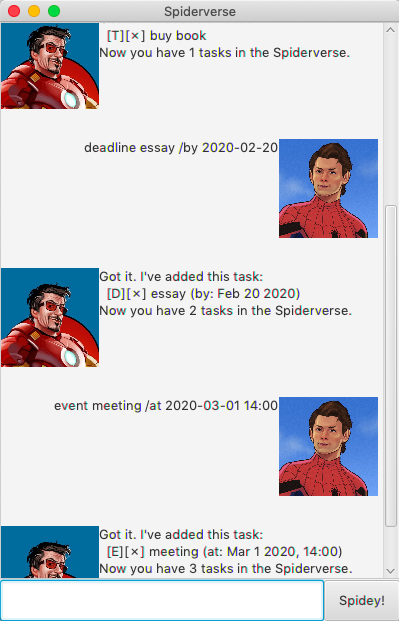
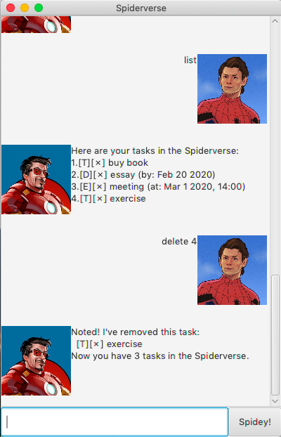
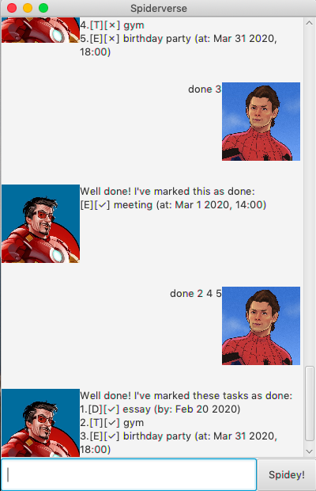
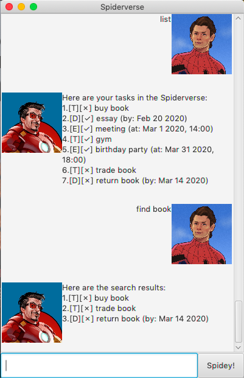
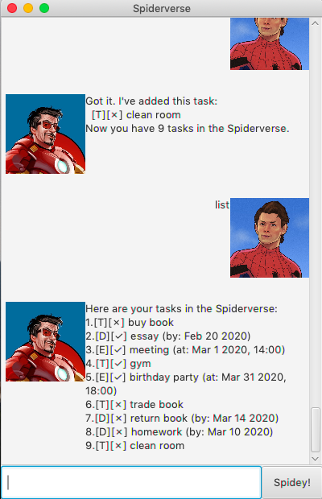

# User Guide of 'Spiderverse'

## About
Spiderverse is a personal Chatbot task manager that follows the theme of Marvel's Spiderman.
It manages all your tasks in a list, keeping you productive and organized. 

## Usage
Command Format:
1. Words in `UPPER_CASE` are parameters entered by you.
2. For parameter `INDEX`, enter a integer corresponding to the task's index in the list.

## Features 

### Feature 1 - Add task
There are three types of tasks that you can add into the list:
1. Todo
2. Deadline
3. Event

Command Format:
1. `todo DESCRIPTION` (eg. todo buy book)
2. `deadline DESCRIPTION /by YYYY-MM-DD` (eg. deadline essay /by 2020-02-20)
3. `event DESCRIPTION /at YYYY-MM-DD HH:mm` (eg. event meeting /at 2020-03-01 14:00)

### Feature 2 - Delete task
You can remove a task from the list.

Command Format: `delete INDEX` (eg. delete 4)

### Feature 3 - Mark task as done
When you are done, you can:
1. Mark a task as completed with a tick.
2. Mark several tasks as completed with ticks at one go.

Command Format: 
1. `done INDEX` (eg. done 3)
2. `done INDEX1 INDEX2 INDEX3` (eg. done 2 4 5)

### Feature 4 - Find task
You can find tasks by entering a keyword. The search result will be given in a list.

Command Format: `find KEYWORD` (eg. find book)

### Feature 5 - List all tasks
You can view all your tasks in a list.

Command Format: `list`

### Feature 6 - Exits Spiderverse
You can exit and close the Spiderverse window.

Command Format: `bye`

